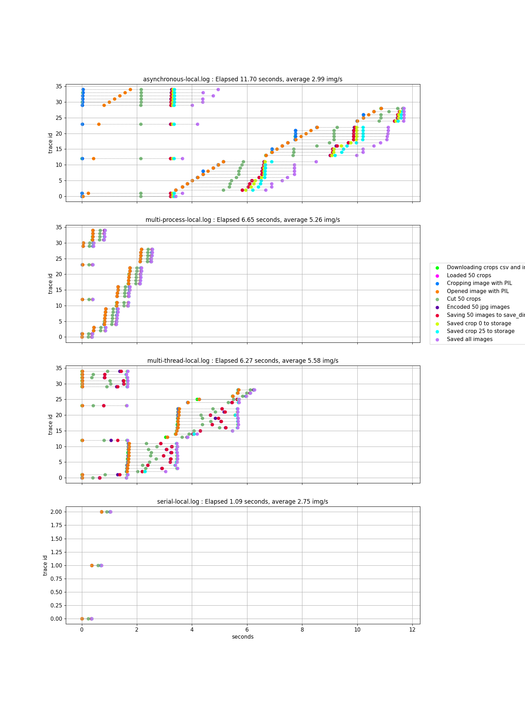
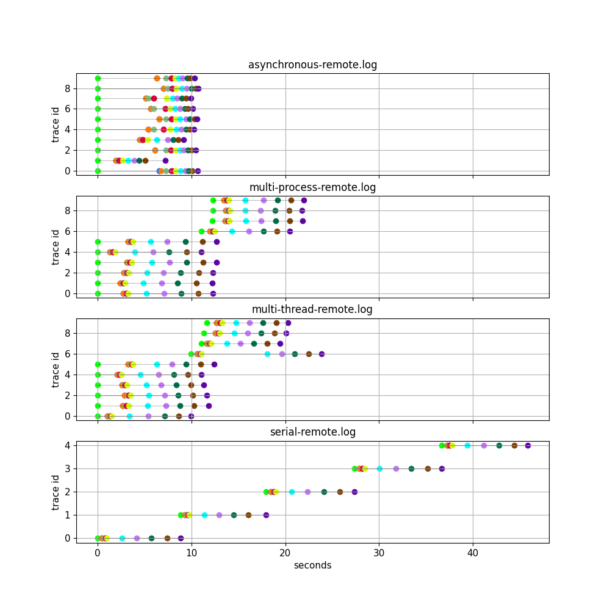

# Summary

The purpose of this project is to benchmark and optimized image download, cropping and upload task.
It's a problem with both IO and CPU bound tasks.

# Plots
## Images read and saved from local disk

## Images read and saved from Google Cloud Storage

