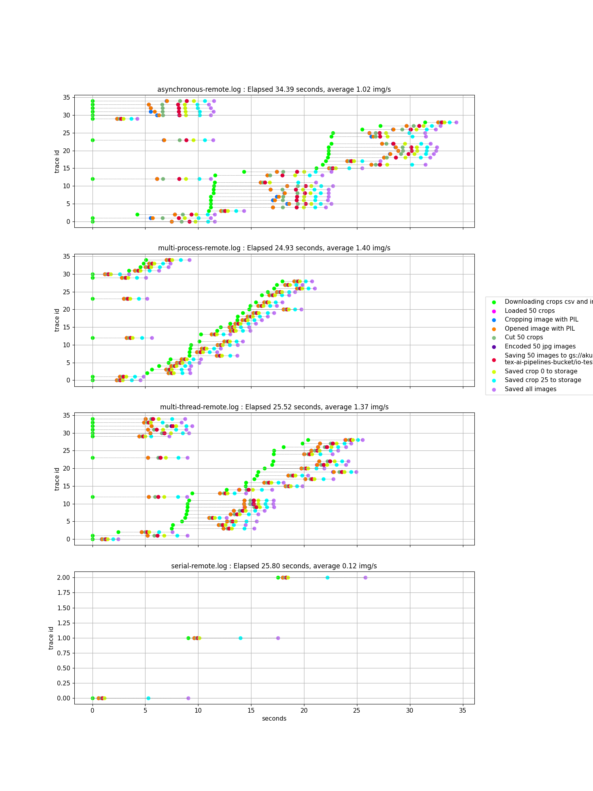

# Summary

The purpose of this project is to benchmark and optimized image download, cropping and upload task.
It's a problem with both IO and CPU bound tasks.

# Usage
Checkout [Taskfile.yml](Taskfile.yml) for available commands.
You'll need [Task](https://taskfile.dev) for that!
# Plots

Notes:
- multiprocess benchmark uses 6 processes on a machine with 6 physcial cores and 12 logical cores.
- multithread benchmark also uses 6 threads.

## Images read and saved from local disk

## Images read and saved from Google Cloud Storage

# References
- inspired by "Shared CPU-I/O Workload" chapter in [High Performance Python](https://www.oreilly.com/library/view/high-performance-python/9781492055013/)
